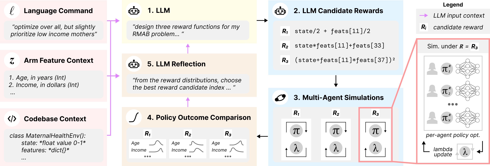

# Decision-Language Model (DLM) for Dynamic Restless Multi-Armed Bandit Tasks in Public Health

<p align="center">
  
</p>

<p align="center">
  <a href="https://nikhilbehari.github.io/dlm"><b>Project page</b></a>
  &nbsp;·&nbsp;
  <a href="https://arxiv.org/abs/2402.14807"><b>Paper</b></a>
</p>

> Behari, N., Zhang, E., Zhao, Y., Taneja, A., Nagaraj, D., & Tambe, M.
> *Decision-Language Model (DLM) for Dynamic Restless Multi-Armed Bandit Tasks in Public Health.*
> NeurIPS 2024.

Restless multi-armed bandits (RMABs) are widely used to allocate scarce
resources in public-health programs, but classical formulations commit
to a single reward function and cannot adapt to evolving policy
priorities. **DLM** treats a large language model as an automated
planner that proposes reward functions as code, trains a
budget-constrained policy under each candidate, evaluates the
resulting behavior against an operator-specified target, and iterates.
The result is rapid policy adjustment from natural-language commands
without manual reward engineering.

## Install

Python 3.11+, with `numpy`, `scipy`, and `torch`.

```bash
git clone https://github.com/NikhilBehari/dlm.git
cd dlm
conda env create -f environment.yml
conda activate dlm
```

Or with pip:

```bash
pip install -e .
```

Each LLM backend installs as an optional extra:

```bash
pip install -e ".[openai]"      # OpenAI models
pip install -e ".[anthropic]"   # Anthropic models
pip install -e ".[gemini]"      # Google models
```

## Configure your model

Copy [`llm_config.example.toml`](llm_config.example.toml) to
`llm_config.toml` and fill in your provider, model, and API key. The
populated file is gitignored.

```toml
provider = "gemini"
model    = "gemini-2.5-flash-lite"
api_key  = "..."
temperature = 1.0
```

## Quickstart

End-to-end DLM loop:

```python
from dlm import (
    DLMTask, compile_reward, default_output_dir,
    load_provider, run_task, synthetic_dataset,
)

dataset  = synthetic_dataset(n_arms=12, n_arm_types=3)
provider = load_provider("llm_config.toml")
task     = DLMTask(
    name="prioritize_type_2",
    goal="Focus the budget on arms whose type is 2.",
    target_reward=compile_reward("state + state * agent_feats[2]"),
)
result = run_task(
    task, dataset, budget=4.0, provider=provider,
    output_dir=default_output_dir(task.name),
    progress=print,
)
print(result.best_candidate.source)
```

Standalone Lagrangian-PPO training under a fixed reward:

```python
from dlm import RMABEnv, ScriptedReward, Trainer, TrainerConfig, synthetic_dataset

env = RMABEnv(
    dataset=synthetic_dataset(n_arms=12, n_arm_types=3),
    budget=4.0,
    reward_fn=ScriptedReward("state + state * agent_feats[2]"),
)
Trainer(env, TrainerConfig(epochs=30)).train()
```

There are three ways to define your RMAB environment, depending on
the form of your input data.

**From raw arrays:**

```python
from dlm import RMABDataset

dataset = RMABDataset(
    transition_matrices=T,         # (N, S, A, S), rows summing to 1
    features=X,                    # (N, F)
    feature_names=("age", "..."),  # optional
    action_costs=[0, 1],           # optional; default arange(A)
)
```

**From a list of per-arm specs** (works for any S, A):

```python
from dlm import Arm, binary_arm, from_arms

arms = [
    binary_arm([1.0, 0.0], p_pull_at_0=0.8, p_pass_at_0=0.2),
    binary_arm([0.0, 1.0], p_pull_at_0=0.5, p_pass_at_0=0.3),
]
dataset = from_arms(arms, feature_names=("type_a", "type_b"))
```

**From a standardized directory on disk:**

```
my_env/
├── env.json         {"feature_names": [...], "action_costs": [...]}
├── transitions.npy  (N, S, A, S)
└── features.npy     (N, F)
```

```python
dataset = RMABDataset.load("my_env/")
dataset.save("my_env/")  # round-trip back to disk
```

Runnable scripts live in [`examples/`](examples/).

## Outputs

Runs persist to `outputs/<timestamp>_<task>/` (gitignored): `config.json`,
`run.log`, `transcript.md`, `training.jsonl`, `prompts.jsonl`,
`candidates.jsonl`, `result.json`.

## Citation

```bibtex
@inproceedings{behari2024dlm,
  title     = {Decision-Language Model {(DLM)} for Dynamic Restless Multi-Armed Bandit Tasks in Public Health},
  author    = {Behari, Nikhil and Zhang, Edwin and Zhao, Yunfan and Taneja, Aparna and Nagaraj, Dheeraj and Tambe, Milind},
  booktitle = {Advances in Neural Information Processing Systems (NeurIPS)},
  year      = {2024},
}
```

## License

Released under the [MIT License](LICENSE).
